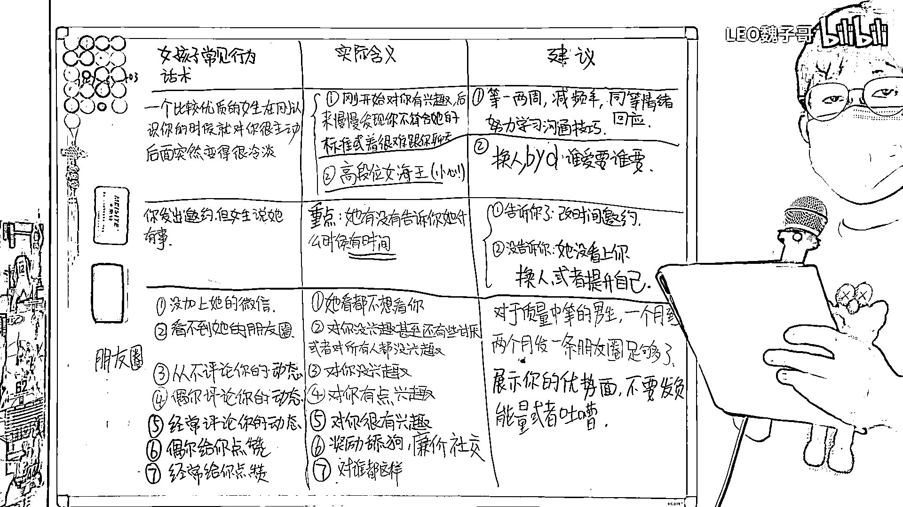

# 女生对男生经典话术、行为与实际含义一览表（沸羊羊大学习系列第二期） - P1 - LEO魏子哥 - BV1km4y1s7WW

大家好，我是魏子哥。今天这期视频我们来继续聊聊女孩子对男孩子的一些行为和话术，以及其背后的深意。，首先，如果说一个比较优质的女生在刚认识你的时候对你很主动，但是聊了一段时间以后突然对你变得比较冷淡。

那这里其实存在两种可能性。，第一种可能性是她在刚开始的时候对你有兴趣，但是后来慢慢发现你不符合她的标准，或者很难跟你聊天。，如果是这种情况的话，兄弟们一定要等一两周再跟她联系，减少和她聊天的频率。

降低你给她的压力，给你们的关系一点缓冲的时间，，回到一个双方都很舒适的状态，并且跟她要有同等的情绪回应，她有多热情，你就有多热情，她有多冷淡，你就有多冷淡。，与此同时。

你要在这段时间努力的学习一下怎么跟女生聊天，因为在这种情况下，女生对你还是有兴趣的，提升一下情商和沟通技巧，你还是有机会把她拿下的。，第二种可能，就是这个女生是一个高段位的女海王，碰到这样的人。

大家一定要小心，尤其是那些没有什么恋爱经验的纯情小男生。，这样的女生，会在你刚认识她的情况下，跟你很热情的聊天，给你营造一种她非常喜欢你的假象，她会连着好几天不停的找你，让你越聊越上头，。

然后在某一天开始，突然对你变得非常非常的冷淡，但是因为你已经上头了，所以你会很纠结，很疑惑，怀疑自己是不是哪里做错了，然后在她身上不断的投入沉没沉稳。，但是你投入的东西越多，你就越难离开她。

越舍不得这段关系，而她就在你的不断投入中获得利益。，这种利益可能是你给她的钱、时间或者你提供的情绪价值，也有可能她单纯就是喜欢操纵人心的感觉。，碰到这样的，兄弟们，不要有任何不舍，直接换人吧，这样的逼。

谁爱要谁要。，如果说呢，你对一个女孩子发出邀约，但是她说她有事来不了，那这个问题的关键就在于她有没有告诉你，她什么时候有时间。，如果她告诉了你什么时候她有时间，那你不用多想，直接改时间跟她约会就行了。。

如果她没有告诉你，她什么时候有空，只是告诉你她很忙，那其实就是她没看上你。，碰到这样的情况，兄弟们可以选择换人或者提升自己。，对于一个男生而言，钱、学历、强壮的身体和积极阳光的心态比任何的女生都要重要。

，任何套路，任何聊天技巧都基于一个前提，就是你要对女生构成吸引。，想要有足够的吸引力，你必须要提升自己。，最后呢，让我们来说说朋友圈相关的问题。，如果一个女生告诉你，她只玩QQ，她不玩微信。

所以她没有让你来加她的微信，，那实际上就是她不仅没看上你，甚至连看都不想看你。，如果说呢，你加了她的微信，但是看不到她的朋友圈，，那么这种情况大概率是这个女生对你没兴趣，甚至呢，还有点讨厌你，。

但是碍于面子，不得不加你的微信。，还有一种可能，就是这个女生对谁都没有兴趣，碰到这两种情况是一点救都没有，兄弟们直接换人吧。，如果说这个女生呢，她从来都不评论你的朋友圈，就说明她对你没有兴趣，。

但如果说这个女生偶尔评论一下你的动态，说明她对你有点兴趣，你可以试着跟她聊一聊。，如果说这个女生经常评论你的动态，那就说明她对你很有兴趣，你有一手好牌。，如果说呢，一个女生偶尔给你的动态点赞，那其实呢。

这就是一种廉价的社交，是一种奖励舔狗的行为。，什么意思呢，就是她对你没有兴趣，但是呢，又不想跟你完全断绝关系，，讲白了，就是不想丢掉你这条狗。，碰到这种情况，不要抱有任何的侥幸心理，直接无视她就行了。。

如果说呢，有一个女生经常给你的朋友圈点赞，你发什么，她就赞什么，你相信我，她对谁都这样，而且她压根都不会关心你发了什么东西。，在朋友圈方面呢，我给兄弟们的建议是，对于质量中等的你男生。

一个月到两个月发一条朋友圈就足够了，，而且不要什么东西都往上发，发的东西一定要能够展示你的优势面，有高逼格的东西，如果没有呢，就不要发。，这里切记，不要发那种负能量的东西，也不要在朋友圈上面吐槽。

尤其不要发那种深夜阴谋文案，晚上哭着发，白天哭着删。，谢谢观看，下期再见！。