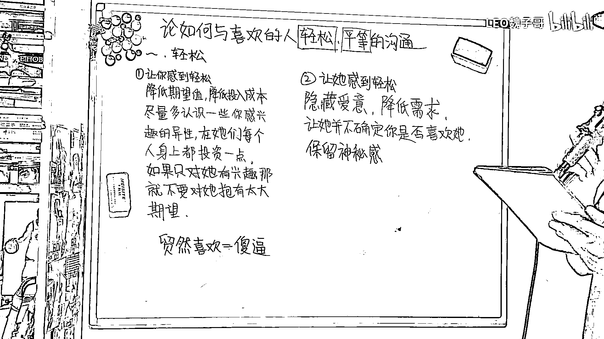
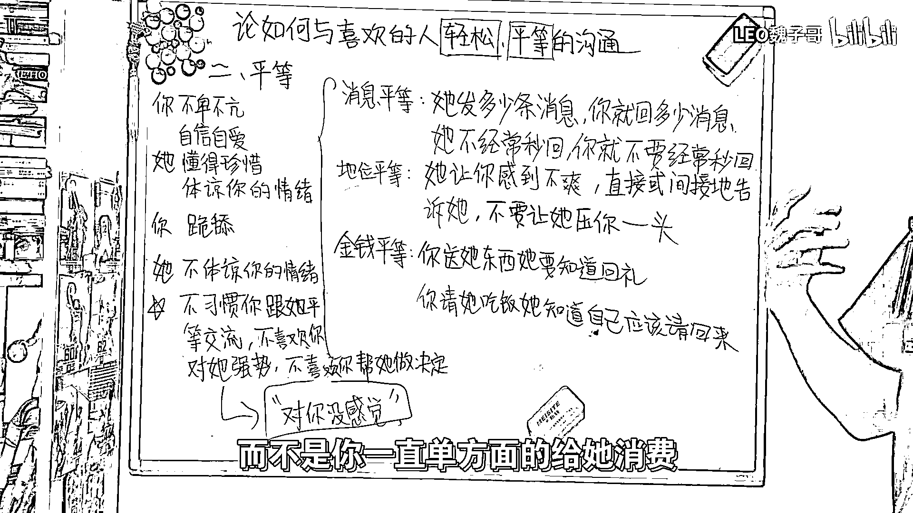

# 必看！如何与喜欢的女生轻松平等的沟通？（沸羊羊大学习附加课） - P1：studio_video_1691843954927.mp4 - LEO魏子哥 - BV1a14y1v76o

大家好，我是魏子哥。，那么今天这期视频我们来聊一聊如何与自己喜欢的女生进行轻松平等的沟通。，首先我们来反思一下自然界当中雄性动物是如何吸引雌性的。，雄性动物为了不错过交配时间。

往往会直接向对方展示自己的条件。，如果对方拒绝，就立即寻找下一个目标，绝对不在他身上浪费时间。，所以让你感觉到轻松的核心就是降低你对他的期望值，不要在他身上投入过多。，从生理的角度上讲。

雄性每天都能产生大量的精子，发生关系的代价很小，而且不用承担生育的责任，所以更主动。，而雌性动物很长时间才能成熟一个卵子，并且需要承担生育的责任，发生关系的代价很大，所以更被动。。

这个现象推广到人类社会，就是男性往往会将自己的优点展示给多个自己感兴趣的女性，在每个人身上稍作投资，，而女性则会在自己的身边选择一个既能够吸引到她，又对她主动的男性做出回应。。

所以要同时认识一些你感兴趣的女生，对她们每个人都主动一点。，如果有的兄弟说，我的社交圈子很窄，或者说最近没什么精力社交，那就一定要对自己感兴趣的女生保持一个很低的期望，，先把她当成朋友。

在对方还没有表现出对你感兴趣的信号时，仅仅因为她的长相，或者她做的一些触动到你的事，就把她定义为你喜欢的人，这就是纯纯的白痴行为。，而让她感觉到轻松的方式，就是隐藏你的爱意，让她感觉不到你的需求感。

让她不确定你是否真的喜欢她。，人总是会对捉摸不透的东西充满好奇，所以保留神秘感非常重要，不要把你的优点一次性全部透露给她，要让她慢慢认识你，长时间带给她新鲜感。，然后我们来说一下平等。

首先平等可以分为三个方面，消息平等，地位平等，和金钱平等。，消息平等就是，她发了多少条消息，你就回她多少条消息，如果她不经常秒回，那你就不要经常和她秒回，如果她发的每一条消息你都秒回。

那就会让她感觉到你很在乎她，你非常渴望收到她的消息，这样反而不好。，第二点是地位平等，如果她做了一些让你感觉到不舒服的事情，你要直接或者间接的告诉她，而不是始终让她压你一头。，第三点是金钱平等。

你送她东西，她要知道回你，如果你请她吃饭，她要知道自己有的时候也应该请回来，而不是你一直单方面的给她消费。，做到平等是非常重要的，如果你不卑不亢，自信自爱，那她就会懂得珍惜你的情绪，懂得体谅你的情绪。。

如果你一直跪舔她，那她就不会体谅你的情绪，而且最为重要的一点，就是她不习惯你跟她平等交流，她始终觉得你低她一等，并且她不会喜欢你对她强势，不会喜欢你帮她做决定。，但有的时候，在恋爱关系中。

女生往往又希望男生能够偶尔对她强势一点，偶尔帮她做做决定，这样子的话，久而久之，她又不习惯你这么做，那么你们的结局就会是，我对你没感觉，你是个好人。，那么。

*收起来*。

