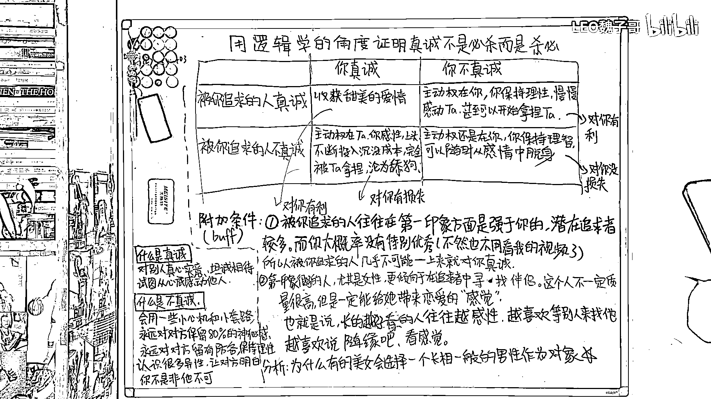

# 用逻辑学的角度证明真诚不是必杀技（沸羊羊大学习系列第四期） - P1 - LEO魏子哥 - BV1Nk4y1G7qN

大家好，我是魏子哥。今天我要向大家用逻辑学的角度来证明，真诚不是必杀，而是杀必，首先我们来明确一下真诚的定义。什么是真诚？真诚就是对别人真心实意，坦诚相待，试图从心底感动他人。

比如说我就是一个非常真诚的人，我认真地做视频，希望从心底打动你们，让你们给我点赞投币关注，那什么是不真诚呢？不真诚指的是会用一些小心机，小套路，永远对对方保留80%的神秘感，永远对对方留有防备。

保持理性，同时认识很多的异性，让对方明白你并不是非他不可，那么现在假如你对你喜欢的人很真诚，而那个被你追求的人对你也很真诚，那么恭喜你，你可以收获一段甜美的爱情。

但是如果说你真诚而被你追求的人对你不真诚，那这个时候主动权就在他，而你会变得感性，上头，在他身上不断地投入沉默成本，完全被他拿捏，最后还有可能沦为舔狗，可是假如你不管对方怎么样，你都不真诚。

那么假如说他对你真诚，那主动权就在你，你保持理性，可以慢慢地感动他，最后甚至还可以开始拿捏他，如果说他对你也不真诚，那主动权还是在你，因为你保持理智，可以随时从感情中脱身，我们来总结一下看。

如果说你真诚了，你有可能获利，也有可能受到损失，而且我相信你受到损失的可能性要比你获利的可能性大得多，可如果你不真诚，情况要么对你有利，要么对你也没有损失，综上所述，保持你的不真诚。

可以永远保证你获得最大的利益，当然，单纯通过纸面上的逻辑，并不能够在复杂的人性当中推出可信的结果，因此我在这里还给大家列了另外几条附加条件，首先，被你追求的人往往是在第一印象方面是强于你的。

这个第一印象就比方说颜值和身材，像这样的人往往会有很多的追求者，而你大概率也没有特别优秀，所以被你追求的人基本上不可能一上来就对你真诚，也就是说，这两种情况，在你们刚开始的时候是基本不可能的，但是。

给人第一印象很好的人，尤其是女性，更倾向于在自己的追求者当中寻找伴侣，她寻找的伴侣不一定质量很高，但是一定能给她带来恋爱的感觉，让她感觉到舒服，也就是说，长得越好看的人，往往越感性。

越喜欢等别人来找她，越喜欢说"随缘吧，看感觉"这样的话，这也就解释了为什么有的美女会选择一个长相一般的男性作为对象，因为长相很好，很受欢迎的男生往往不愿意主动出击，这个时候。

如果某一个长相并不出众的男生对她不卑不亢，跟女孩子的聊天很得体，很有分寸，在她的圈子里也很受女性欢迎，再加上一两个能够偶尔拿出手表现一下的特长，增加一下她的神秘感，那就很容易从她的追求者当中脱颖而出。

，这个时候，男生再适当的用一些小技巧，增加她对她的沉默成本，时间一长，这个美女自然而然就离不开她了，好，我给大家几秒钟的时间截一下屏，记一下笔记，如果说，你长得好看，很优质，那你可以随缘找。

可以感性选择，也就是等别人来追，但这种情况下，你只能向下兼容，也就是你只能找到比自己质量更低的异性，如果你长得不好看，没那么优质，但是又想找一个好看的，那这个时候你就只能减少盲目的真诚，保持理性。

扩展自己的社交圈子，广撒网，保持自己的神秘感，并且在合适的时候用一点小心机，小套路，谢谢观看，下集再见，( ̄▽ ̄)。

按讚&追蹤臉書FB: @FASHIONECSTASY。