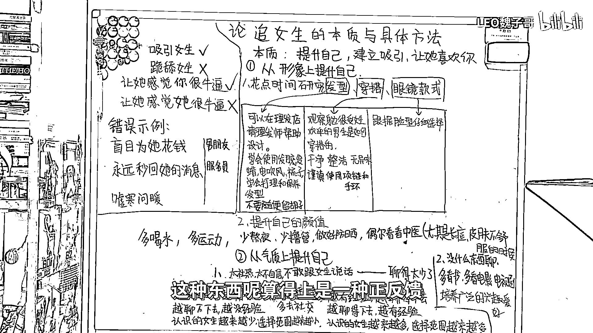
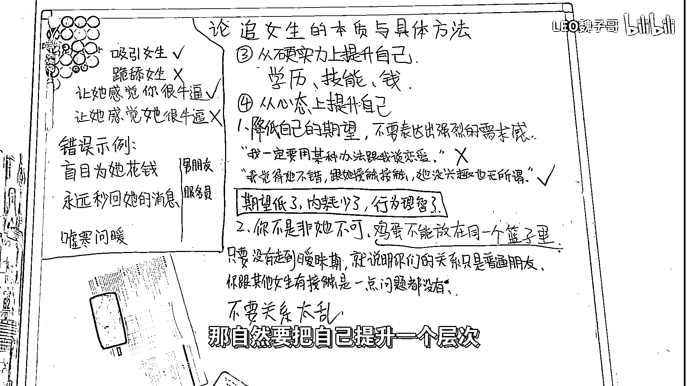

# 追女生的本质和具体方法（沸羊羊大学习系列最后一期） - P1 - LEO魏子哥 - BV1EV411V7No

大家好，我是魏子哥。那么今天这期视频，我来跟大家说一说追女生的本质与具体方法，首先，追女生是吸引女生，而不是跪舔女生，追女生最终要达到的效果，是让她感觉到你很牛逼，进而喜欢你。

而不是让她感觉到她很牛逼，可以拿捏你，如果说，在你面对你喜欢的女生的时候，你不去思考如何能够吸引到她，只是盲目的为她花钱，永远的秒回她的信息，或者经常对她嘘寒问暖，那么恭喜你，你基本上就要寄了。

因为人家要的是一个可以吸引到她，并且能够不断给她带来新鲜感的男朋友，人家不要舔狗，所以说，追女生的本质是提升自己，建立吸引，让她喜欢你，具体应该怎么做？首先，兄弟们记住一句话。

三观决定了两个人能不能在一起，而形象决定了对方愿不愿意认识你，你要是顶着黑眼圈，脸上油乎乎，穿着发黑的白色T恤，还他妈击涂，那谁愿意认识你啊，所以第一步就是提升自己的形象，如何提升？

直接看这个就好了，第二步，兄弟们要从气质上提升自己，在面对女生时，你能否不设口，敢聊天，保持自信，说话得体大方，眼睛看着该看的地方，如果说，你太设口，太不自信，不敢跟女生说话。

那其实就是你跟女生聊天聊的太少了，没有跟异性相处的经验，这种东西算得上是一种正反馈，你越没经验，越聊不下去，越聊不下去，就越没经验，认识的女生就越来越少，选择范围也就越来越窄，但是，如果你越有经验。

就越聊得下去，越聊得下去，就越有经验，而你认识的女生也就会越来越多，你的选择范围也就会越来越广，如果你想改变现状，从这儿到这儿的话，那你就必须要多去接触一些异性，多去社交，讲白了。

就是你得出门去找机会认识女生，而不是他妈待在家里面，等着女孩子从天上掉下来砸到你头上，你可以去一些失调性比较强的场所，或者说参加一些社团和组织，实在不行你就在大街上搭讪，而不是整天要么打游戏。

双视频，要么就一头扎进球场，等你聊了几个人有的东西你自然就懂了。另一方面，如果说你觉得你和女生没什么东西可以聊，那你就把你的时间拿出来，多看看书，多看看电影电视剧，多培养一些兴趣爱好，行。

我给大家一点时间截一下图，第三点，兄弟们要从硬实力上提升自己。所谓的硬实力，就是你的学历，你的技能，还有你的钱，优秀的人当然想跟优秀的人在一起，如果你想要获取更优质的伴侣。

那自然要把自己提升一个层次，第四点，也是我个人认为最重要的一点，要从心态上提升自己，很多兄弟在看到自己喜欢的人的时候，非常容易上头，而上头就意味着失去理智，作为男性。

理性是我们永远也不能放弃的最强大的武器，如果你遇到了一个你很感兴趣的人，你的第一反应不应该是我一定要用某种方法让他跟我谈恋爱，而应该是我觉得他还不错，我想跟他接触接触，但是如果他没兴趣的话。

我也无所谓，你对他的期望值低了，你的精神内耗就少了，你的行为也就理智了，这样对方跟你相处的时候，感觉不到你的目的性，和你聊天的压力就小了，自然也就更愿意和你接触，同时，兄弟们也应该记住。

你不是非他不可，你不是动漫男主，你没有那么帅，没有哪个漂亮女生会在看到你的第一眼就对你一见钟情，把你那专一恋爱脑收一收，不要把全部鸡蛋放在一个篮子里，多撒网，多接触，只要没有走到暧昧期。

就说明你们的关系只是普通朋友，你跟其他女生有接触，那是一点问题都没有，甚至，如果说，你跟你身边的女生玩得很好，得体，大方，又不失分寸，这在你喜欢的女生眼里看来，甚至是一个很好的加分项，但是这里切记。

关系不要太乱，不要带着其他女生跑去喝酒共敌，更不要把你和其他女生的聊天记录刻意的展示给你喜欢的人，尝试去给他压力，这样只会让你一秒被拉黑，那么今天这期视频也是我做飞鸦阳大学习视频系列的最后一期。

希望大家看了我这一系列视频以后，能够真正的在你们的情感上有所帮助，谢谢，(CC字幕製作:貝爾)，(可惜沒補上)。

